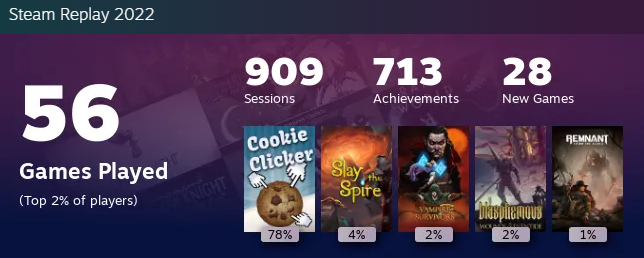

# Steam Flashback
```
This bot, in no shape or form, has a connection to Steam
It's a personal project with integration of the Steam API
```

## Welcome to your **flashback**!
This bot was created to have an in-depth analisys of **all games** you played during the year so you can have more meaningful statistics than those sourced by Steam with the `Steam Replay` feature.

## Index

- [What is the "Steam Flashback" bot?](#what-is-the-steam-flashback-bot)
- [Why the bot was created](#why-the-bot-was-created)
- [How the bot was created](#how-the-bot-was-created)
- [How the bot works](#how-the-bot-works)
- [Meet the developer ☁](#meet-the-developer) <sub>(She is pretty cool)</sub>

## What is the "Steam Flashback" bot?
The `Steam Flashback` bot is a *Telegram bot* created to record and analyze all gaming data throughout the year and create a better analysis of all the progress done on all games played. The main objective is to create some kind of customization for the analysis so new graphs and percentages can be viewed and other game's data can be compared.

## Why the bot was created
The `Steam Flashback` bot idea came to me at the end of 2022, when *Steam* released the **Steam Replay** feature and I got some quite strange statistics:

<h1 align="center">
    
</h1>

As you can see, I "played" for 78% of the time *Cookie Clicker*, an ***idle game***. This one game that I kept open while I work simply broke my `Steam Replay` number and I was pretty bummed about it. Given that, I realized that it would happen *again* in 2023, since I'm trying to 100% the game and I'm at the point of just letting the own game do it's things for a few days and check every now and then.

## How the bot was created

This bot was created and (at the time of this writing) is stil in development. I'm more familiar with `Javascript` and I'm looking for taking this bot a little further with it's own website for a more user-friendly experience.

For now, the main libraries/dependencies I'm using are:

| Library                                       | version |
|:---------------------------------------------:|:-------:|
| [axios](https://axios-http.com/docs/intro)    | v1.1.3  |
| [dotenv](https://www.npmjs.com/package/dotenv)| v16.0.3 |
| [moment](https://momentjs.com/)               | v4.18.2 |
| [telegraf](https://telegrafjs.org/#/)         | v4.11.2 |

## How the bot works

The `Steam Flashback` bot has an integration with the [Steam Web API](https://developer.valvesoftware.com/wiki/Steam_Web_API) and, through it, I can send 10k requests per day. At this moment, we have, for users, *five* different methods, all of them controlled via Telegram:

 > /create - Create an `Steam Flashback` account linking you Telegram ID to you Steam ID

 > /check - Checks for how long yopu have been registered and how many games are being monitored

 > /game - Gives you the numbered list of *all* games being monitored and, if called *`/game [number]`* shows playtime and achievements (if applicable) of the game selected

 > /delete - Completely erases all saved info linked to the user

 > /dev - Shows some developer basic information

 Since you are reading this, you can see all the bot can do, so you may have seen that are **DEV Tools** implemented in the code. This bot is expected to do *auto updates* of the database daily. **For now**, I couldn't figure out how to do it, so, I do it manually, starting an routine that verifies if it's a `Steam Flashback` dev ID to start, otherwise it will show apparently no response.

 There are some unused code that I created to reformat my database, but I didn't want to remove it yet so I have it as future reference of processes and how I optimized it.

## Meet the developer

`Sky Alarcon ☁` is the only developer of the `Steam Flashback` bot.

She is a trans woman, teacher, cyclist and gaming enthusiast. As a gamer, at the time of this README, she already got *100% achievements* on **more than 30 games** and tattooed, at least, one reference for each game/series she completed.

Some games she 100%'ed are:
 - [Dark Souls REMASTERED](https://store.steampowered.com/app/570940/DARK_SOULS_REMASTERED/)
 - [Celeste](https://store.steampowered.com/app/504230/Celeste/)
 - [Hollow Knight](https://store.steampowered.com/app/367520/Hollow_Knight/)
 - [Katana Zero](https://store.steampowered.com/app/460950/Katana_ZERO/)
 - [Cuphead](https://store.steampowered.com/app/460950/Katana_ZERO/) + [Delicious Last Course](https://store.steampowered.com/app/1117850/Cuphead__The_Delicious_Last_Course/)

If you wish to see the full list, she got a [Trello](https://trello.com/b/ZfOeZVIe/games) with all games she wants to play/played/100%'ed there.

<h1 align="center">
    <a href="https://www.instagram.com/_skydoceu"></a>
</h1>